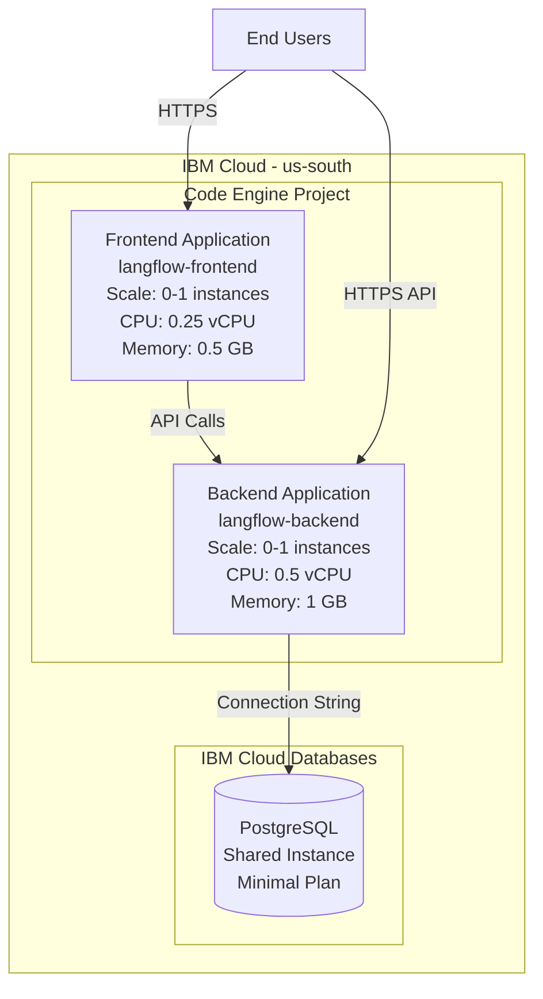

# Langflow on IBM Cloud - Deployment Plan

## 📋 Overview

This plan outlines the deployment of Langflow (full-stack application) on IBM Cloud using:
- **Compute**: IBM Cloud Code Engine (serverless containers)
- **Database**: IBM Cloud Databases for PostgreSQL
- **IaC Tool**: Terraform
- **Region**: us-south
- **Cost Strategy**: Minimal scale configuration

## 🏗️ Architecture



## 📦 Components

### 1. IBM Cloud Code Engine Project
- **Purpose**: Container for all Code Engine resources
- **Configuration**: Default settings with minimal quotas

### 2. PostgreSQL Database
- **Service**: IBM Cloud Databases for PostgreSQL
- **Plan**: Shared/Standard (smallest available)
- **Configuration**:
  - Memory: 1 GB (minimum)
  - Disk: 5 GB (minimum)
  - SSL/TLS: Enabled
  - Backup: Daily (1-day retention)

### 3. Backend Application
- **Image**: `langflowai/langflow-backend:latest`
- **Scaling**:
  - Min instances: 0 (scale-to-zero)
  - Max instances: 1
  - CPU: 0.5 vCPU
  - Memory: 1 GB
- **Environment Variables**:
  - `LANGFLOW_DATABASE_URL`: PostgreSQL connection string
  - `LANGFLOW_CONFIG_DIR`: `/app/config`
  - Additional variables can be added post-deployment

### 4. Frontend Application
- **Image**: `langflowai/langflow-frontend:latest`
- **Scaling**:
  - Min instances: 0 (scale-to-zero)
  - Max instances: 1
  - CPU: 0.25 vCPU
  - Memory: 0.5 GB
- **Environment Variables**:
  - `BACKEND_URL`: Backend application URL
  - Additional variables can be added post-deployment

## 📁 Project Structure

```
langflow-ibmcloud/
├── terraform/
│   ├── main.tf              # Main infrastructure resources
│   ├── variables.tf         # Input variables with defaults
│   ├── outputs.tf           # Output values (URLs, credentials)
│   ├── providers.tf         # IBM Cloud provider configuration
│   ├── versions.tf          # Terraform version constraints
│   └── terraform.tfvars.example  # Example variables file
├── .gitignore               # Ignore state files and secrets
├── README.md                # Deployment instructions
└── DEPLOYMENT_PLAN.md       # This file
```

## 🔧 Terraform Resources

### Resources to Create:

1. **ibm_resource_group** (optional) - Resource group for organization
2. **ibm_code_engine_project** - Code Engine project
3. **ibm_database** - PostgreSQL database instance
4. **ibm_code_engine_app** (backend) - Backend application
5. **ibm_code_engine_app** (frontend) - Frontend application
6. **ibm_code_engine_secret** - Database credentials
7. **ibm_code_engine_config_map** - Application configuration

## 💰 Cost Estimation

### Monthly Costs (Approximate):

| Service | Configuration | Estimated Cost |
|---------|--------------|----------------|
| Code Engine - Backend | 0-1 instances, 0.5 vCPU, 1GB RAM | $0-5 |
| Code Engine - Frontend | 0-1 instances, 0.25 vCPU, 0.5GB RAM | $0-3 |
| PostgreSQL | Shared, 1GB RAM, 5GB disk | $30-50 |
| **Total** | | **$30-58/month** |

*Note: Code Engine charges only for actual usage with scale-to-zero enabled*

## ✅ Prerequisites

1. **IBM Cloud Account** with billing enabled
2. **IBM Cloud API Key** (already available)
3. **Terraform** installed (v1.0 or higher)
4. **Git** for version control
5. **IBM Cloud CLI** (optional, for verification)

## 📝 Implementation Steps

### Phase 1: Setup (Todo Items 1-2)
- [ ] Create project directory structure
- [ ] Configure Terraform providers and versions

### Phase 2: Core Infrastructure (Todo Items 3-4)
- [ ] Create Code Engine project
- [ ] Provision PostgreSQL database

### Phase 3: Applications (Todo Items 5-6)
- [ ] Deploy backend application
- [ ] Deploy frontend application

### Phase 4: Configuration (Todo Items 7-8)
- [ ] Configure environment variables
- [ ] Set up service bindings

### Phase 5: Documentation (Todo Items 9-12)
- [ ] Create variables.tf with defaults
- [ ] Create outputs.tf
- [ ] Write comprehensive README
- [ ] Add .gitignore

## 🔐 Security Considerations

1. **API Key Storage**: Store IBM Cloud API key in environment variable or Terraform Cloud
2. **Database Credentials**: Managed via Code Engine secrets
3. **SSL/TLS**: Enabled for all connections
4. **Network**: Code Engine provides built-in network isolation
5. **Secrets Management**: Use Code Engine secrets for sensitive data

## 🚀 Deployment Process

1. **Initialize Terraform**:
   ```bash
   cd terraform
   terraform init
   ```

2. **Configure Variables**:
   ```bash
   cp terraform.tfvars.example terraform.tfvars
   # Edit terraform.tfvars with your API key
   ```

3. **Plan Deployment**:
   ```bash
   terraform plan
   ```

4. **Apply Configuration**:
   ```bash
   terraform apply
   ```

5. **Access Applications**:
   - Frontend URL: Output from Terraform
   - Backend URL: Output from Terraform
   - Database: Connection string in outputs

## 📊 Post-Deployment Configuration

After deployment, you can manually configure:
- Langflow authentication settings
- Custom API keys
- Additional environment variables
- Application-specific settings

Access Code Engine console to update environment variables without redeploying.

## 🔄 Maintenance

- **Updates**: Change image tags in Terraform and reapply
- **Scaling**: Adjust min/max instances in Terraform
- **Monitoring**: Use IBM Cloud monitoring dashboard
- **Logs**: Access via Code Engine console or CLI

## 📚 References

- [Langflow Deployment Examples](https://github.com/langflow-ai/langflow/tree/main/deploy)
- [Langflow Docker Configuration](https://github.com/langflow-ai/langflow/tree/main/docker)
- [IBM Cloud Code Engine Docs](https://cloud.ibm.com/docs/codeengine)
- [IBM Cloud Databases for PostgreSQL](https://cloud.ibm.com/docs/databases-for-postgresql)
- [Terraform IBM Cloud Provider](https://registry.terraform.io/providers/IBM-Cloud/ibm/latest/docs)

## ✨ Next Steps

Ready to proceed with implementation? Switch to **Code mode** to create the Terraform configuration files.